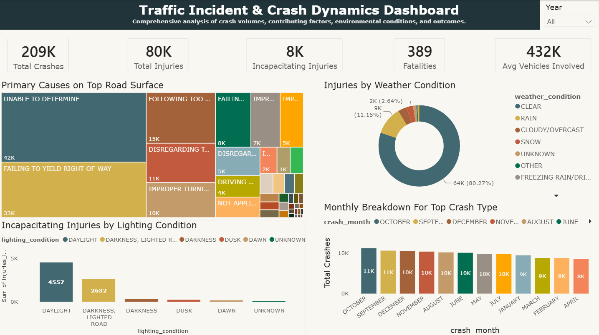

# Traffic Accident Analysis

Analysis of traffic accident patterns, injury severity, road conditions, contributing factors, and crash trends using MySQL and Power BI.

## Project Overview

This project analyzes traffic accident data to identify patterns in crash occurrences, injury severity, roadway conditions, environmental factors, and contributing causes.

The analysis was designed to answer five analytical questions focused on injury patterns, lighting conditions, road surface conditions, contributing causes, crash types, and monthly crash occurrences.

## Dataset

The dataset contains **209,306 records and 24 columns**, covering traffic accidents recorded between **2013 and 2025**.

The dataset includes information on:

* Crash dates
* Weather conditions
* Lighting conditions
* Road surface conditions
* Road defects
* Crash types
* Primary contributory causes
* Total injuries
* Incapacitating injuries
* Fatalities
* Other accident-related characteristics

### Data Quality

| Metric                          |    Result |
| ------------------------------- | --------: |
| Original records                |   209,306 |
| Duplicate records identified    |        31 |
| Records after duplicate removal |   209,275 |
| Columns                         |        24 |
| Date range                      | 2013–2025 |

## Analytical Questions

1. Which weather condition has the highest total injuries?
2. Which lighting condition has the highest and lowest incapacitating injuries?
3. Which road surface condition has the highest number of crashes, and what is the most common primary contributory cause within that condition?
4. What is the most common first crash type?
5. Which month has the highest and lowest occurrence of the most common crash type?

## Tools Used

* **MySQL** — data cleaning and exploratory data analysis
* **Power BI** — data visualization and dashboard development

## Data Cleaning

The dataset was cleaned and prepared using SQL before conducting the analysis.

The cleaning process included:

* Inspecting the dataset structure and data quality
* Checking for duplicate records
* Identifying duplicate records
* Removing duplicate records
* Reviewing unknown values across relevant categorical fields
* Reviewing and preparing date fields
* Validating the cleaned dataset after preparation

After removing the identified duplicates, the dataset contained **209,275 records**.

## Exploratory Data Analysis

SQL was used to aggregate and investigate the dataset according to the five analytical questions.

The analysis examined:

* Total injuries by weather condition
* Incapacitating injuries by lighting condition
* Crash frequency by road surface condition
* Primary contributory causes within the highest-crash road surface condition
* First crash type frequency
* Monthly occurrence of the most common crash type

## Key Findings

### Injury Patterns

* Approximately **80,000 total injuries** were recorded.
* Approximately **8,000 incapacitating injuries** were recorded.
* The dataset recorded **339 fatalities**.
* **Clear weather** accounted for the highest proportion of recorded injuries, representing approximately **80.27%** of recorded injuries.
* **Daylight** recorded the highest number of incapacitating injuries, with **4,557 cases**.

### Road Surface and Contributing Causes

* **Dry road surface** recorded the highest number of crashes.
* Among crashes occurring on dry roads, **Unable to Determine** was the most common primary contributory cause, accounting for approximately **42,000 crashes**.

### First Crash Type

* The most common **first crash type** was **Turning** with approximately **64,000 crashes**.

### Monthly Crash Pattern

For the most common crash type:

* **October** recorded the highest number of crashes, at approximately **11,000**.
* **April** recorded the lowest number, with **8,463** crashes.

## Dashboard

The final Power BI dashboard presents the major findings from the analysis through interactive visualizations.

## Project Files

### `01_data_cleaning.sql`

Contains the SQL queries used to inspect, clean, standardize, and prepare the dataset for analysis.

### `02_exploratory_data_analysis.sql`

Contains the SQL queries used to answer the analytical questions and derive the project's findings.

### `Traffic_Accidents_Dashboard.pbix`

Contains the completed Power BI dashboard used to visualize the analysis.

### `traffic_accidents_dashboard.png`

Provides a static preview of the completed Power BI dashboard.

## Outcome

The analysis provided insights into traffic accident patterns across environmental, roadway, crash, and injury-related factors.

The project demonstrates an end-to-end data analytics workflow involving:

**Data Quality Assessment → SQL Data Cleaning → Exploratory Data Analysis → Insight Generation → Power BI Visualization**

## Key Skills Demonstrated

* SQL data cleaning
* Data quality assessment
* Duplicate detection and removal
* Data validation
* SQL aggregation and filtering
* Exploratory data analysis
* Analytical question development
* Insight generation
* Power BI dashboard development
* Data visualization
* Communicating analytical findings
